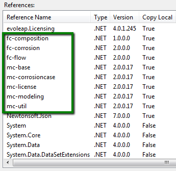
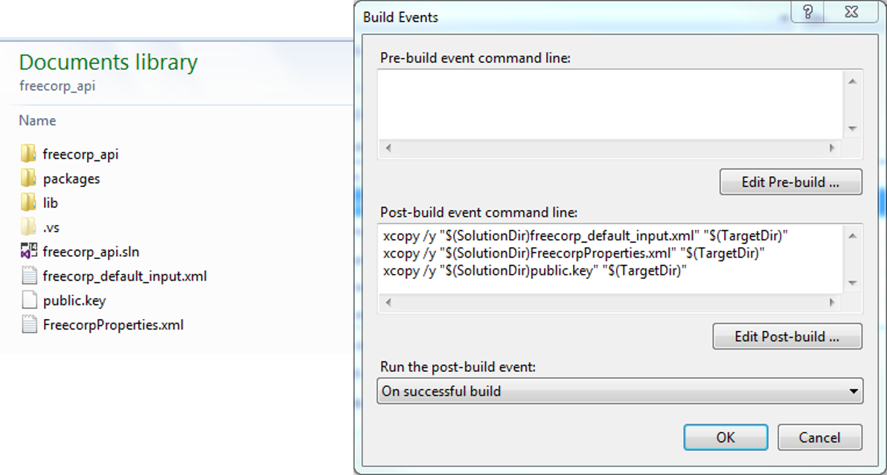
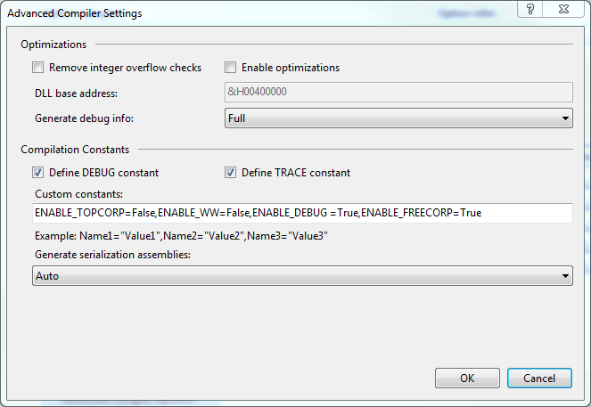

## How to run simulations by using FREECORP&trade; API?

FREECORP&trade; APIs are distributed in two core .net DLL files (fc-modeling.dll, fc-base.dll, fc-util.dll), 
and several model specific DLLs such as fc-composition.dll for chemistry related models, fc-flow.dll for 
flow related models. The FREECORP&trade; simualtion models are contained in fc-corrosion dll. \
It is possible to write a .Net (either in C# or vb.Net) program and the FREECORP&trade; APIs to perform
most of the operations available in the gui of the software.

### Project setup
Apart from the necessary DLLs, a .Net project also needs nuget packages, some properties and
public key files as well as have some special build configurations. Please follow the guidelines below
and the sample project, which may be downloaded from [download link of sample project]. 

* Reference necessary DLLs in your .net project. Note that both C# and VB.net project can reference 
these DLLs. However, only vb.net project is used as demo. C# projects will be very similar.



* Two configuration files: multicorp_default_input.xml and MulticorpProperties.xml, and a public key file need to be 
present in the target folder of the .net project. Easiest way to make sure they are available in the 
target folder after every build is to store them in the project folder and then write a ‘build event’ 
to copy them to target folder after every build.



* It is manadatory to also put the following compile options, especially the custom constant settings in order to select
the right product to build.




### Workflow of a typical case

#### Initialize License, configuration and settings  

```vbnet
If AbstractModel.licenseValid Then
   MulticorpRunner.initialize()
End If
```

#### Create a new Case

```vbnet
Dim caseFactory As CaseFactory = AbstractModelFactory_
.getFactory(AbstractModelFactory.AbstractModels.CORROSIONCASE)
Dim cCase As AbstractCase = caseFactory.createModel()
cCase.readDefaultValue()
```

#### Choose corrosion type

```vbnet
CType(cCase.getParameter(NameList.CORROSION_TYPE), OptionParameter)_
.setValue(AbstractCase.CorrosionPosition.BLC)
cCase.onCorrosionTypeChanged()
```

#### Choose flow type

```vbnet
CType(cCase.getParameter(NameList.FLOW_TYPE), OptionParameter)_
.setValue(FlowModel.FlowType.FREE_FLOW)
cCase.onFlowTypeChanged()
```

#### Choose simulation type 

```vbnet
'Set simulation Engine
CType(cCase.getParameter(NameList.SIMULATION_ENGINE), OptionParameter)_
.setValue(CorrosionModel.SimulationEngine.Freecorp)
cCase.onSimulationEngineChanged()
'Set simulation Type as transient
CType(cCase.getParameter(NameList.SIMU_TYPE), OptionParameter)_
.setValue(CorrosionModel.SimulationModelType.FreeCorp_Transient)
cCase.onSimulationTypeChanged()
'Set simulation Type as steady state
CType(cCase.getParameter(NameList.SIMU_TYPE), OptionParameter)_
.setValue(CorrosionModel.SimulationModelType.FreeCorp_Steady_State)
cCase.onSimulationTypeChanged()
```

#### Set input parameter values
The format for calling APIs to set a value to an input parameter is as follows: get the model object from case 
by method `getModel`; get the parameter object from the model object by method `getParameter` (the parameter name 
in the argument should be same as displayed on the UI); and then input the value in the Parameter object by 
method setValue.
The input value should be in the base unit of the particular parameter. Every parameter has a unit type and 
every unit type has a base unit. The base unit is used as default unit in which the value needs to be supplied.
However, FREECORP&trade; provides unit conversion tools which are described in next section.

```vbnet
Dim simulation As AbstractModel = cCase.getModel(NameList.MODEL_NAME_CORROSION_MODEL)
simulation.getParameter(NameList.TEMPERATURE).setValue(20)
simulation.getParameter(NameList.TOTAL_PRESSURE).setValue(10)
simulation.getParameter(NameList.CO2_GAS_CONTENT).setValue(1)
simulation.getParameter(NameList.H2S_GAS_CONTENT).setValue(0.01)
simulation.getParameter(NameList.WATER_SPEC_HAC).setValue(0)
simulation.getParameter(NameList.PH).setValue(4)
simulation.getParameter(NameList.WATER_SPEC_FE2).setValue(1)
simulation.getParameter(NameList.WATER_SPEC_NACL).setValue(0)
simulation.getParameter(NameList.SIMU_DURATION).setValue(1 / 60)
simulation.getParameter(NameList.SECTION_DIAMETER).setValue(0.1)
simulation.getParameter(NameList.SUPERFICIAL_WATER_VELOCITY).setValue(1)
```

#### Read parameter values

Once parameter object is retrieved in the same way an Input parameter object is retrieved (described above), the value 
of the `Parameter` can be retrieved by method `getValue()`. FREECORP&trade; provides unit conversion. The output value of a 
parameter can be retrieved in base unit by method `getValue()`. The value can be converted to another unit from 
same unit type by method `getViewValue()`.

```vbnet
Dim totalPressure As Parameter = CType(cCase.getParameter(NameList.TOTAL_PRESSURE), Parameter)
Console.WriteLine("Value of total pressure in Bar = " + totalPressure.getViewValue(util.units.Unit.BAR))
```

#### Perform simulation

```vbnet
If Not simulation Is Nothing Then
   If CType(simulation, CorrosionModel).isCorrosionPossible() Then
        If CType(simulation, CorrosionModel).prepareSimulation() Then
           CType(simulation, CorrosionModel).simulate()
        End If
   End If
End If
```

#### Retrieve simulation results

* Transient model
```vbnet
Dim corrosionResult As CorrosionResult = CorrosionResultManager.getInstance()
If corrosionResult.hasData() Then
   Dim crSeries As Series = CType(corrosionResult, SinglePointModelResult).getOverallCR()
   Console.WriteLine("Corrosion rate over time -->" + vbNewLine + crSeries.generateCSVContent)
   ' 0 for bulk, 1 for bulk surface, 2 for steel surface concentration of species
   Dim concFe2PlusSurface As Series = CType(corrosionResult, SinglePointModelResult)_
   .getConcentrationOnLayer(2, "Fe2+")
   Console.WriteLine("Surface concentration of Fe2+ over time --> "_
    + vbNewLine + concFe2PlusSurface.generateCSVContent)
End If
```
* Steady State model
```vbnet
Dim h2oredux As Series = corrosionResult_
.getDataset(NameList.STEADYSTATE_OPTION_NODE_H2O_REDUCTION, 0, 1)
Console.WriteLine("H2O Reduction over time -->" + vbNewLine + h2oredux.generateCSVContent)
```